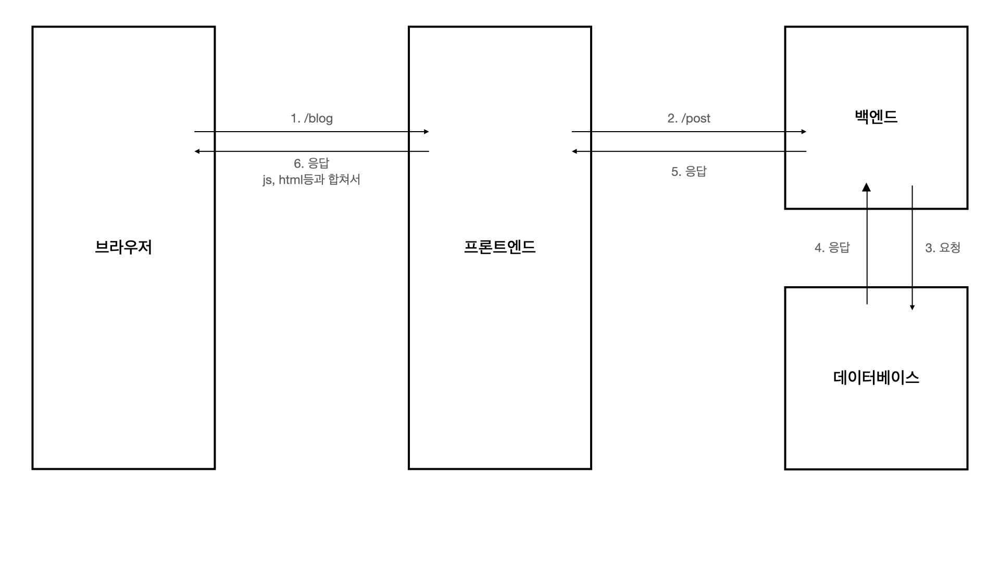
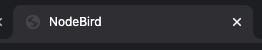

# NodeBird 정리

- Hello, Next.js

  ## Next.js를 사용하는 이유

  → 실무적으로 접근하는 것(효율성)

  but, 리액트를 사용한 프레임워크이기때문에 정해진 틀 안에서 코딩해야해서 자유도가 줄어드는 단점은 있음.

  리액트를 **서버사이드렌더링**으로 돌리기위한 프레임워크.

  ## SSR (Server Side Rendering) (전통적인 방식)

  

  브라우저 → 프론트엔드 서버 → 백엔드 서버 → 데이터베이스 → 백엔드 서버 → 프론트엔드 서버 → 브라우저

  장점 : 화면이 한방에 잘 그려짐

  단점 : 데이터를 불러오기까지 시간이 걸려서 속도가 느림

  ## SPA (Client Side Rendering) (리액트, 뷰, 앵귤러)

  

  1. 브라우저(/blog) → 프론트엔드 서버(js, html, css, img 등 데이터가 없는 모든 페이지 파일들 (방문하지 않을 파일들까지도)) ⇒ 브라우저(데이터가 없으므로 로딩창 표시)
  2. 브라우저(/posts 데이터 요청) → 백엔드 서버 → 데이터베이스 → 백엔드 서버 → 브라우저(가져온 데이터들을 프론트에서 받은 껍데기에 끼워넣음)

  장점 : 사용자에게 기다릴 때의 인터렉션을 줄 수 있음. 앱을 사용하는 듯한 좋은 사용자 경험

  단점 : 검색엔진이 로딩창 인터렉션을 보고 미완성된 페이지인 줄 알고 나가버림 → 검색에 뜨지 않음.

  ## Next.js

  next를 사용하는 경우는 `import React from 'react'` 를 쓸 필요가 없다. but, 습관적으로 써주는게 좋기는 하다

  pages라는 폴더를 무조건 만들어줘야 한다. next가 자체적으로 해당 폴더 안에 있는 모든 파일을 개별의 페이지로 만들어주기 때문이다. (Code Spliting)

  pages를 제외한 다른 폴더는 딱히 정해진 이름이 없다.

  → 해서, component들로 나눈 componenets 라는 폴더를 만들었다.

  next는 자체적인 라우터가 있다. - 매우 강력한 동적 라우팅

  → 원래 react에서 라우팅을 하려면 react-route-dom 등을 깔았어야 했다.

  `import Link from 'next/link'`

  **주의사항 : Link 태그를 사용했을 때 href="'/" 이후 <a> 태그를 써줘야 한다.**

  next는 저장을 하면 nodemon 또는 react의 hard loader처럼 계속 리로드 된다.

  ## SQL vs NoSQL

  웬만하면 NoSQL(mongoDB 등) 보다 SQL (MySQL 등) 을 더 추천한다.

  대부분의 서비스들은 각 데이터간 **관계가 분명히 존재**하기 때문이다.

  관계가 있는데 SQL을 못쓰는 이유는 그냥 본인의 SQL 실력이 낮은 것이다.

- antd를 사용해 SNS 화면 만들기

  백엔드 개발자의 api와 데이터가 준비되어있지 않다는 가정 → 더미데이터 사용 (react에서는 상태를 저장하는 state 이용)

  ***

  원래 import는 자바스크립트만 할 수 있는데 next에 내장된 webpack이 css를 보는 순간 style태그로 바꿔서 html에다가 넣어준다.

  ***

  모든 페이지(pages 폴더 전체)에 공통적으로 적용해야하는 사항들은 \_app.js라는 파일을 만들어서 넣어준다.

  next에서는 `import Head from 'next/head'` 를 써서 헤드를 수정할 수 있게 한다.

  ```jsx
  // 페이지의 공통되는 것들을 처리할 수 있다.
  import React from "react";
  import "antd/dist/antd.css";
  import Head from "next/head";

  const App = ({ Component }) => {
    return (
      <div>
        <Head>
          <meta charSet="utf-8" />
          <title>NodeBird</title>
        </Head>
        <Component />
      </div>
    );
  };

  export default App;
  ```

  - 여기서 Head는 탭의 이름이다.

    

  - {Component}를 인자로 줘서 Head만 설정하고 하위 데이터들은 각 페이지에서 가져온다.

  반응형은 모바일 → 태블릿 → 웹으로 디자인 해야한다.

  antd는 24등분이다. material은 12였던 것 같다.

  xs, sm, md등등 break point는 커스텀하게 바꿀 수 있지만, 기본적으로 Grid 탭에 정해져 있다.

  gutter = 간격

  row를 24등분해서 반응형으로 나눠갖는 건 좋은데, 너무 따닥따닥 붙어있으면 보기에 별로니까 gutter라는 값을 줘서 간격을 늘린다.

  <a> 를 이용해 링크를 넣고 새 탭에서 띄우기 위해 `target = "_blank"` 를 했을 때, 보안 위험이 뜰 수도 있으므로 `rel="noreferrer noopener"` 를 꼭 써주자. → 새 창을 열 때, refferrer와 opener라는 정보가 같이 딸려나가는 것을 방지하는 역할이다.

  style에다가 객체를 넣으면 안된다. 이유 ? ⇒ 리렌더링 될 때마다 함수를 다시 실행하는데, 객체도 새로 생성되고 새로 생성된 객체는 기존의 객체와 값이 같아도 다르게 판정 ( `{} === {} // false` ) 하기 때문에 이 로그인 폼도 바뀌지 않았음에도 새로 렌더링한다. (자원소모가 더 됨)

  styled components는 `const * = styled.div` `` 이런식으로 쓴다 ← div 컴포넌트가 됨.

  다른 특정 component를 수정하고 싶으면, const \* = styled(compoenents)`` ← 이렇게 사용하면 된다.

  ex)

  ```jsx
  <Input.Search enterButton style={{verticalAlign: "middle"}}>

  ---

  const SearchInput = styled(Input.Search)`
  vertical-align:middle
  `

  <SearchInput enterButton />
  ```

  ***

  **styled-compoenents를 사용하지 않을 때**

  useMemo를 사용.

  ```jsx
  import React, {useMemo} from 'react'

  const style = useMemo(() => ({marginTop: 10}), [])
  <div style={style}></div>
  ```

  ***

  **useMemo와 useCallback의 차이?**

  useCallback → 함수를 캐싱

  useMemo → 값을 캐싱

  what is 캐싱 ?

  ***

  hooks. 즉 함수형 컴포넌트에서 리렌더링이 될 때에는 함수 안의 부분이 다시 실행되지만, useCallback이나 useMemo는 데이터가 캐싱되어 있으므로 배열 안이 바뀌지 않는 이상 같은 것으로 쳐서 리렌더링이 되지 않는다.

  but, inline style같은 경우는 바뀌었다고 판단해서 리렌더링이 된다 → 쌓이다보면 엄청난 성능 손실

  → 이게(함수 안 return 부분) 가상 돔이다.

  ***

  **button에다가 htmlType = "submit" 을 붙여줘야 제일 앞 태그 Form이 submit이 된다.**

  ***

  antd에서 Form에 onFinish를 달아주면, 이미 `e.preventDefault()` 가 적용되기 때문에 다시 쓸 필요가 없다. → `e.preventDefault()` 는 <a>같은 경우 링크에 따라 창이 변경되는 것을 방지해준다.(이벤트 전파 중지)

  ***

  react에서 배열로 jsx를 쓸 때에는 key를 붙여줘야 한다.

  ***

  is undefined 에러가 뜨면 보통은 선언 or import를 하지 않은 것이다.

  ***

  어느정도 react에 익숙해지면, 한줄 한줄 <div></div> <div></div> 써내려가지 말고 <nickNameEditForm /> <FollowList /> 등 컴포넌트를 쭉 적어놓고 한개씩 코딩하는게 훨씬 효율적이다.

  ***

  form 만드는것이 비효율적인게 많아서, 웬만하면 react form 같은 라이브러리 가지고 만드는것을 추천한다.

  → 지금은 기초적인 강좌라 웬만하면 만들고 있는데 사실 좀 귀찮은 작업들이다.

  ***

  반복되는 hooks가 보이면 커스텀 훅을 만들면 편하다.

  ```jsx
  const [id, setId] = useState("");
  const [password, setPassword] = useState("");

  const onChangeId = useCallback((e) => {
    setId(e.target.value);
  }, []);
  const onChangePassword = useCallback((e) => {
    setPassword(e.target.value);
  }, []);
  ```

  → 이런거..

  root 폴더에 hooks를, 내부에 useInput.js를 만든다.

  중복되는 부분을 가져온다.

  ```jsx
  import { useState, useCallback } from "react";

  export default (initialValue) => {
    const [value, setValue] = useState(initialValue);

    const handler = useCallback((e) => {
      setValue(e.target.value);
    }, []);

    return [value, handler];
  };
  ```

  이후 loginForm에서,

  ```jsx
  const [id, setId] = useState("");

  const onChangeId = useCallback((e) => {
    setId(e.target.value);
  }, []);
  ```

  이 부분을

  ```jsx
  const [id, onChangeId] = useInput("");
  ```

  한 줄로 줄여버릴 수 있다.
